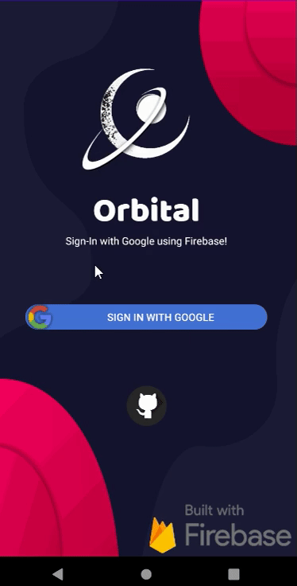

 Project 1 - *Simple Todo*

**Orbital Note** is an android app that allows building a todo list and basic todo items management functionality including adding new items, editing and deleting an existing item.

Submitted by: **Randy Alvarez**

Time spent: **300~** hours spent in total

## User Stories

The following **required** functionality is completed:

* [x] User can **view a list of todo items**
* [x] User can **successfully add and remove items** from the todo list
* [x] User's **list of items persisted** upon modification and and retrieved properly on app restart

The following **optional** features are implemented:

* [x] User can **tap a todo item in the list and bring up an edit dialog fragment for the todo item** and then have any changes to the text reflected in the todo list

The following **additional** features are implemented:

* [x] User can **see the number of items** on the list through a counter on the top navigation bar
* [x] User can **share and save the list of items** through any email client and file storage app on the user's phone
* [x] User can **login with a google account** using the sign in button 
* [x] User can **logout** using the logout button
* [x] User can go to this repository and download their own clone by clicking the github logo 
* [x] Added a custom made animated logo gif
* [x] Added animated gradient backgrounds for "add" and "save" buttons
* [x] User can search the list of items using the edit text and image button added to the top navigation bar

## Video Walkthrough                                                                       

Here's a walkthrough of implemented user stories:

  

GIF created with [LiceCap](http://www.cockos.com/licecap/).

## Login

## Notes

Describe any challenges encountered while building the app. There were too many to count. :)

## License

    Copyright [yyyy] [name of copyright owner]

    Licensed under the Apache License, Version 2.0 (the "License");
    you may not use this file except in compliance with the License.
    You may obtain a copy of the License at

        http://www.apache.org/licenses/LICENSE-2.0

    Unless required by applicable law or agreed to in writing, software
    distributed under the License is distributed on an "AS IS" BASIS,
    WITHOUT WARRANTIES OR CONDITIONS OF ANY KIND, either express or implied.
    See the License for the specific language governing permissions and
    limitations under the License.
